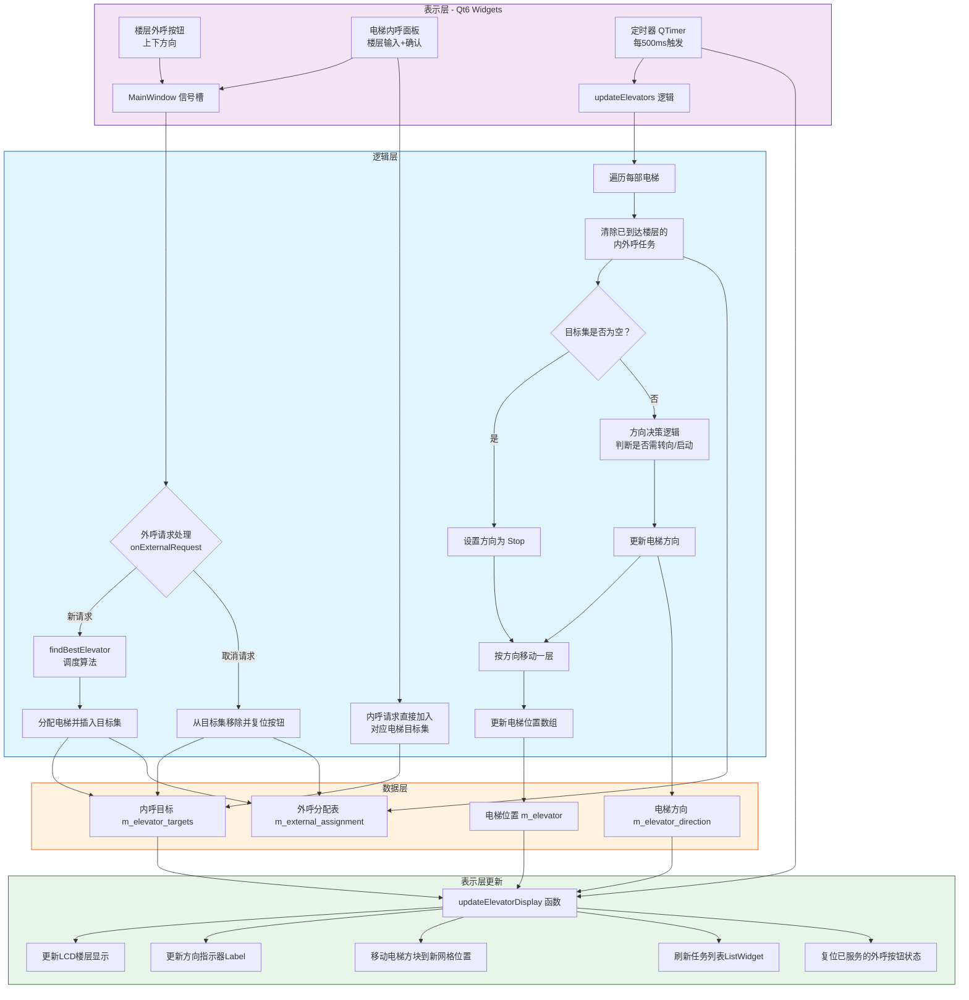
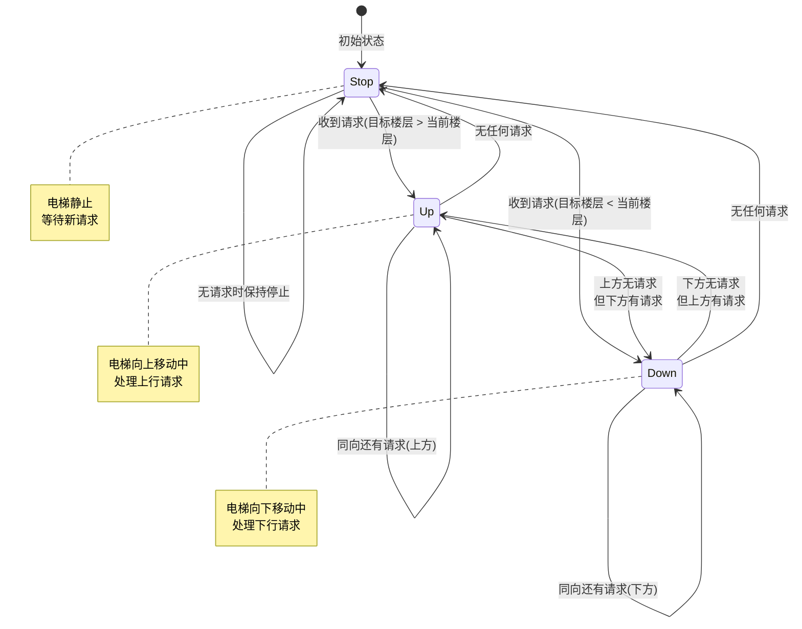
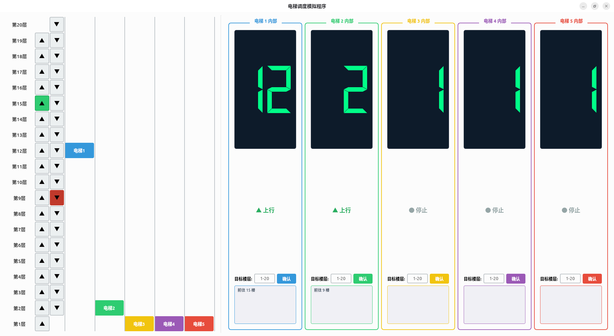
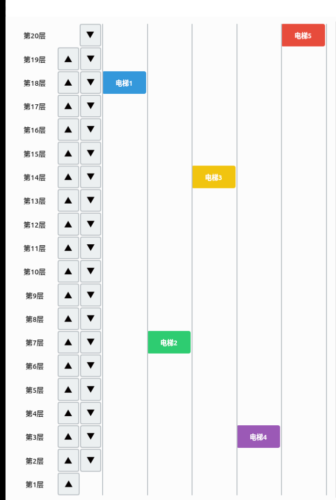
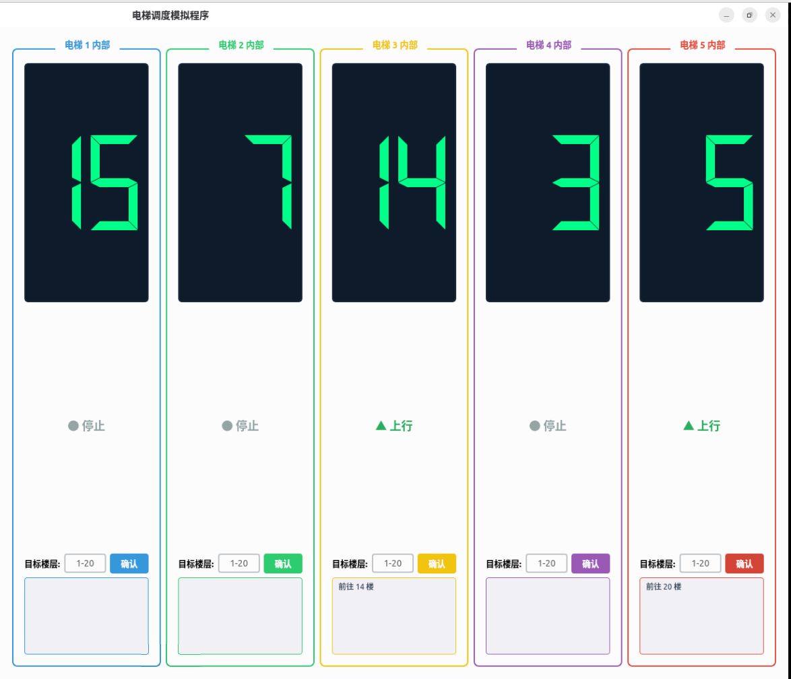

# 操作系统——进程管理项目

## 电梯调度模拟

## 1. 项目介绍

### 1.1 项目背景

某栋楼共 20 层，配备 5 部互联的电梯。基于定时器事件驱动思想，编写一个电梯调度模拟程序。将电梯视为处理机（CPU），乘客的乘梯请求视为待调度进程，通过调度算法将外部请求分配到合适的电梯上执行，从而模拟操作系统处理机调度的核心思想。

### 1.2 项目目的

通过模拟电梯调度，深入理解操作系统处理机调度策略与资源分配机制。掌握事件驱动编程模型以及 C++ 语言在图形界面程序中的应用。

## 2. 需求分析

### 2.1 电梯内部操作

每部电梯内部提供目标楼层输入框，乘客可输入 1～20 的目标楼层，确认后该请求被加入该电梯的待服务任务列表。电梯运行时按照当前方向逐层移动，每到达一个目标楼层则完成该次服务并从任务列表中移除。

### 2.2 外部楼层呼叫

每层楼（除顶层无上行键、底层无下行键）均设有上行按钮与下行按钮。乘客按下外部按钮相当于创建一个外部请求进程，系统根据调度算法为该请求分配一部最合适的电梯前往接载。请求被满足后，对应按钮自动复位。

### 2.3 调度需求

调度算法需要综合考虑以下因素：

- 电梯当前所在楼层与请求楼层的距离
- 电梯当前的运行方向与请求方向是否一致
- 电梯已有的待服务任务数量

要求在保证响应速度的同时，避免出现个别电梯负荷过重或某些请求长期得不到响应（饥饿）的问题。

## 3. 功能描述

### 3.1 电梯调度

电梯内部面板输入目标楼层后，该请求直接加入对应电梯的任务集合。若电梯当前处于静止状态，则根据目标楼层相对于当前位置的方向自动启动运行。

对于外部楼层按钮的请求，系统通过调度算法计算每部可用电梯的代价，选择代价最低的电梯进行分配。分配后该目标楼层被加入对应电梯的任务集合，并在请求完成时自动清除。

### 3.2 调度算法理论基础

本项目的调度算法融合了多种经典电梯调度思想：

-**先到先服务算法（FCFS）**：按请求产生的时间顺序依次处理。实现简单、公平，但在负载较高时平均等待时间显著增加。

-**最短寻找楼层时间优先算法（SSTF）**：每次选择距离当前电梯最近的请求。能有效降低平均响应时间，但响应时间方差较大，远离电梯的请求可能出现"饥饿"现象。

-**扫描算法（SCAN）**：电梯沿当前方向持续移动，处理该方向上的所有请求，到达最远端后反向移动。相比 SSTF 大幅消除了不公平性。

-**LOOK 算法**：SCAN 算法的改进版本。电梯沿当前方向移动，但当发现该方向上不再有请求时立即改变方向，无需移动到物理端点。

本项目的调度算法采用了带权重的代价评估模型，在 LOOK 方向决策的基础上融入任务负载均衡因子，形成一种改进的调度策略。

## 4. 开发环境

| 项目     | 说明                                  |

| -------- | ------------------------------------- |

| 操作系统 | Ubuntu 22.04.5 LTS x86_64/ Windows 11 |

| 开发软件 | VSCode / Qt Creator                   |

| 开发语言 | C++17                                 |

| GUI 框架 | Qt6 Widgets                           |

| 构建系统 | CMake 3.16+                           |

| 编译器   | GCC / MSVC                            |

## 5. 系统设计

### 5.1 总体架构

本项目采用单窗口架构，以 `MainWindow` 类（继承自 `QMainWindow`）作为核心控制器，集中管理所有的电梯状态、请求队列、调度逻辑以及界面更新。系统整体分为三个逻辑层次：

-**数据层**：存储电梯位置、方向、任务目标、外部请求分配关系等核心状态数据。

-**逻辑层**：实现调度算法和电梯状态机，由定时器周期性驱动更新。

-**表示层**：基于 Qt6 Widgets 的图形界面，实时反映电梯位置和运行状态。

系统运行流程图如下：



### 5.2 数据结构设计

核心数据结构全部作为 `MainWindow` 的成员变量，采用静态数组进行管理。

| 变量名                               | 类型          | 作用                                                    | 初始值            |

| ------------------------------------ | ------------- | ------------------------------------------------------- | ----------------- |

| `m_elevator[ELEVATOR_NUM]`           | `int[]`       | 每部电梯当前所在楼层（1～HEIGHT）                       | `{1, 1, 1, 1, 1}` |

| `m_elevator_direction[ELEVATOR_NUM]` | `Direction[]` | 每部电梯当前运行方向                                    | `Direction::stop` |

| `m_button_checked[HEIGHT+1][2]`      | `bool[][]`    | 外部按钮按下状态，`[i][0]` 为上，`[i][1]` 为下          | `false`           |

| `m_elevator_targets[ELEVATOR_NUM]`   | `QSet<int>[]` | 每部电梯的待服务目标楼层集合                            | 空集              |

| `m_external_assignment[HEIGHT+1][2]` | `int[][]`     | 外部请求分配记录，值为负责响应的电梯编号，-1 表示未分配 | `-1`              |

**方向枚举定义：**

| 枚举值            | 含义 |

| ----------------- | ---- |

| `Direction::up`   | 上行 |

| `Direction::down` | 下行 |

| `Direction::stop` | 停止 |

**全局常量：**

| 常量名         | 值       | 说明                  |

| -------------- | -------- | --------------------- |

| `HEIGHT`       | `20`     | 楼层总数              |

| `ELEVATOR_NUM` | `5`      | 电梯数量              |

| 定时器间隔     | `500 ms` | 电梯每 0.5 秒移动一层 |

`QSet<int>` 选用理由：目标楼层集合需要高效的去重与删除，`QSet` 提供平均 O(1) 的插入、删除和查找操作，适合频繁更新的场景。内部基于红黑树实现的自排序特性（`QSet` 底层使用 `QHash` 结合排序）也可便于方向决策时快速获取最近/最远目标。

### 5.3 状态机设计

每部电梯的运行状态由方向枚举 `Direction` 控制，形成三态状态机，状态转移图如下：



**状态转换规则：**

1.**stop → up / down**

   电梯从静止启动，当有内部或外部请求加入且目标楼层不同于当前位置时，根据目标楼层与当前楼层的相对关系确定方向（目标在上方则上行，在下方则下行）。

2.**up / down → stop**

   当前方向上不再有任何待服务目标时，电梯停止。

3.**up ↔ down（转向）**

   当电梯沿当前方向到达最远目标后，若反方向仍有待服务目标，则自动反转方向继续服务。此行为体现了 LOOK 算法的核心特征：不需要到达物理端点即可转向。

## 6. 算法设计

### 6.1 外部请求调度算法（findBestElevator）

该算法是系统的核心调度逻辑，在外部按钮触发新请求时被调用，从 5 部电梯中选出代价最低的一部。

**算法思路：**

对每部电梯计算一个综合代价值 `cost`，由以下因素加权求和得到：

| 成本因素 | 计算公式                | 权重/说明                                                                      |

| -------- | ----------------------- | ------------------------------------------------------------------------------ |

| 基础距离 | `abs(pos - floor) * 10` | 距离乘以 10 作为基础成本，使距离差异在代价中占主导地位                         |

| 空闲电梯 | 无额外成本              | 空闲电梯不附加任何方向惩罚，仅按基础距离评估                                   |

| 同向顺路 | 无额外成本              | 电梯运行方向与请求方向相同且请求在前进路径上，无需附加成本                     |

| 同向逆路 | `+100`                  | 电梯运行方向与请求方向相同但请求在身后，需先走完当前方向再回头，附加较大惩罚   |

| 反向     | `+200`                  | 电梯运行方向与请求方向相反，需完成当前方向全部任务后才能反向服务，附加最大惩罚 |

| 任务负载 | `targets.size() * 30`   | 已有任务数量乘以负载因子，防止单部电梯被分配过多任务而导致其他请求等待时间过长 |

**综合代价公式：**

```

cost = abs(pos - floor) × 10 + direction_penalty + targets.size() × 30

```

其中 `direction_penalty` 的取值为：

- 空闲或同向顺路：`0`
- 同向逆路：`100`
- 方向相反：`200`

最终选择 `cost` 最小的电梯作为分配目标。若有多个电梯代价相同，选择下标较小的（代码中按升序遍历，先遇到的保留）。

**源代码：**

```cpp

// 最佳电梯选择

intMainWindow::findBestElevator(intfloor, intreqDir)

{

int best = -1;

int minCost = INT_MAX;

    // 计算最低成本

for (int i = 0; i < ELEVATOR_NUM; ++i)

    {

int pos = m_elevator[i];

        Direction dir = m_elevator_direction[i];

        // 基础距离成本，乘10方便加权计算

int bestDist = std::abs(pos - floor) * 10;

int cost = bestDist;

if (dir == Direction::stop)

            ; // 空闲电梯，无需计算其他成本

        // 同向顺路，也无需计算其他成本

elseif ((reqDir == Direction::up && dir == Direction::up && floor >= pos) ||

                 (reqDir == Direction::down && dir == Direction::down && floor <= pos))

            ;

        // 同向但是不顺路，增加一定cost

elseif ((reqDir == Direction::up && dir == Direction::up && floor < pos) ||

                 (reqDir == -1 && dir == -1 && floor > pos))

            cost += 100;

        // 方向相反

else

            cost += 200;

        // 加入已有任务量的cost，避免饥饿

        cost += m_elevator_targets[i].size() * 30;

        // 更新最小cost

if (cost < minCost)

        {

            minCost = cost;

            best = i;

        }

    }

return best;

}

```

**设计原则分析：**

- 基础距离乘以 10 使其在代价计算中占主导地位，保证了距离优先的原则（类似 SSTF）；
- 方向惩罚权重（100/200）使得顺路电梯优先于逆路/反向电梯，体现 LOOK 算法的"沿当前方向优先服务"思想；
- 负载因子（30）有效缓解饥饿问题——已承担较多任务的电梯对后续请求的"吸引力"降低，自然将新请求导向负载较轻的电梯；
- 权重值的差异化设计（10 : 30 : 100 : 200）经过了合理的量级分隔，确保各因素在决策中发挥预期作用而不会互相淹没。

### 6.2 电梯状态更新算法（updateElevators）

该算法由定时器以 500ms 为周期驱动执行，每次调用完成一轮电梯状态更新，包括：到达判断、方向决策和位置移动。

**步骤一：到达判断与服务完成**

```cpp

// 迭代判断

int current = m_elevator[i];             // 当前电梯位置

Direction dir = m_elevator_direction[i]; // 当前电梯方向

// 内呼：移除当前位置

if (m_elevator_targets[i].contains(current))

{

m_elevator_targets[i].remove(current);

}

// 向上的外呼

if (current != HEIGHT && m_external_assignment[current][0] == i)

{

m_external_assignment[current][0] = -1;

    // 复位对应按钮

int floorIdx = HEIGHT - current;

m_up_button[floorIdx]->blockSignals(true);

m_up_button[floorIdx]->setChecked(false);

m_up_button[floorIdx]->blockSignals(false);

}

// 向下的外呼

if (current != 1 && m_external_assignment[current][1] == i)

{

m_external_assignment[current][1] = -1;

    // 复位对应按钮

int floorIdx = HEIGHT - current;

m_down_button[floorIdx]->blockSignals(true);

m_down_button[floorIdx]->setChecked(false);

m_down_button[floorIdx]->blockSignals(false);

}

```

当电梯到达目标楼层时，从任务集合中移除该目标。若该目标来自外部请求，同时清除分配记录并复位对应楼层的外部按钮状态（通过 `blockSignals` 阻断信号以避免递归触发调度逻辑）。

**步骤二：方向决策（LOOK 算法规范）**

```cpp

// 方向决策

if (m_elevator_targets[i].isEmpty())

    dir = Direction::stop;

else

{

bool isInDir = false;

for (int t : m_elevator_targets[i])

    {

if ((dir == 1 && t > current) || (dir == -1 && t < current))

        {

            isInDir = true;

break;

        }

    }

if (!isInDir)

    {

        // 检查反方向有无请求

bool hasAbove = false, hasBelow = false;

for (int t : m_elevator_targets[i])

        {

if (t > current)

                hasAbove = true;

if (t < current)

                hasBelow = true;

        }

        // 反方向有请求：转向

if (dir == Direction::up && hasBelow)

            dir = Direction::down;

elseif (dir == Direction::down && hasAbove)

            dir = Direction::up;

        // 从静止启动

elseif (dir == Direction::stop)

        {

int first = *m_elevator_targets[i].begin(); // set 自动排序

            dir = (first > current) ? Direction::up : Direction::down;

        }

    }

} // 方向决策结束

m_elevator_direction[i] = dir;

```

此逻辑体现了 LOOK 算法的核心特征：电梯沿当前方向移动，优先服务该方向上的所有请求；当该方向不再有目标时立即反转方向（不走到物理端点）；若任务集合为空则停止。

**步骤三：位置移动**

```cpp

// 电梯移动一层

if (dir != Direction::stop)

{

int next = current + (dir == Direction::up ? 1 : -1);

if (next >= 1 && next <= HEIGHT)

m_elevator[i] = next;

else

m_elevator_direction[i] = Direction::stop; // 边界

}

```

电梯每次移动一层，到达边界时自动停止（实际运行中此情况极少发生，因为 LOOK 算法会在到达端点前转向）。

### 6.3 请求处理流程

**内部请求（电梯内输入目标楼层）：**

```

用户输入目标楼层 → 校验（1~20）→ 加入 m_elevator_targets[elevIdx]

→ 若电梯静止：根据目标楼层相对位置设置方向 → 等待定时器驱动执行

```

**外部请求（楼层按钮按下）：**

```

用户按下楼层按钮 → onExternalRequest()

→ 已分配检查（避免重复分配）

→ findBestElevator() 计算最优电梯

→ 记录分配关系 m_external_assignment[floor][dir] = best

→ 加入 m_elevator_targets[best]

→ 若分配电梯静止：设置方向 → 等待定时器驱动执行

```

**请求取消（楼层按钮弹起）：**

```

用户弹起楼层按钮 → onExternalRequest(checked=false)

→ 查找分配的电梯 → 从目标集合移除该楼层

→ 清除分配记录 → 复位按钮状态

```

## 7. 界面设计

程序主界面采用左右分区布局：左侧为楼层视图（展示各楼层及上下行按钮、可视化电梯位置），右侧为 5 部电梯的控制面板（分别显示当前楼层数码管、运行方向、目标楼层输入框及待服务任务列表）。



### 7.1 楼层视图区域

左侧网格布局展示全部 20 层楼的楼层标签、上行/下行按钮，并在对应列显示 5 部电梯的实时位置（以彩色标签标注）。电梯位置随定时器驱动实时刷新，直观反映各电梯当前所在楼层。



### 7.2 电梯面板区域

每部电梯拥有独立的控制面板，包含：

- LCD 数码管：显示当前所在楼层
- 方向指示器：以箭头和文字显示当前运行方向（上行/下行/停止）
- 楼层输入框：接收 1～20 的目标楼层输入
- 确认按钮：确认目标楼层请求
- 任务列表：实时显示该电梯当前所有待服务的目标楼层

  

## 8. 关键技术点

### 8.1 信号与槽机制

程序充分利用 Qt6 的信号槽机制实现松耦合的事件驱动架构。对外部按钮的 `toggled` 信号连接调度入口 `onExternalRequest`，对确认按钮的 `clicked` 信号连接内部请求分发 `floorRequested`，通过自定义信号在对象间传递数据而无需直接持有对象引用。

### 8.2 定时器驱动的更新循环

以 `QTimer` 作为核心驱动，每 500ms 触发一次 `updateElevators()` + `updateElevatorDisplay()` 的联合刷新。这种设计使得电梯移动的速度统一可控，所有电梯在同一时钟周期内完成位置更新与界面刷新，避免了多线程同步的复杂性。

### 8.3 权重参数的调校

调度算法中的权重参数（10、30、100、200）经过了区分度的考虑：

- 距离权重（×10）确保距离为第一优先级
- 负载权重（×30）意味着 3 层楼的距离当量约等于 1 个已分配任务的惩罚，约 7 层楼当量可抵消方向相反惩罚
- 这样的参数设计使得：在同距离条件下，空闲电梯 > 同向顺路电梯 >> 同向逆路电梯 >> 反向电梯 >> 高负载电梯，形成了合理的优先级梯队
